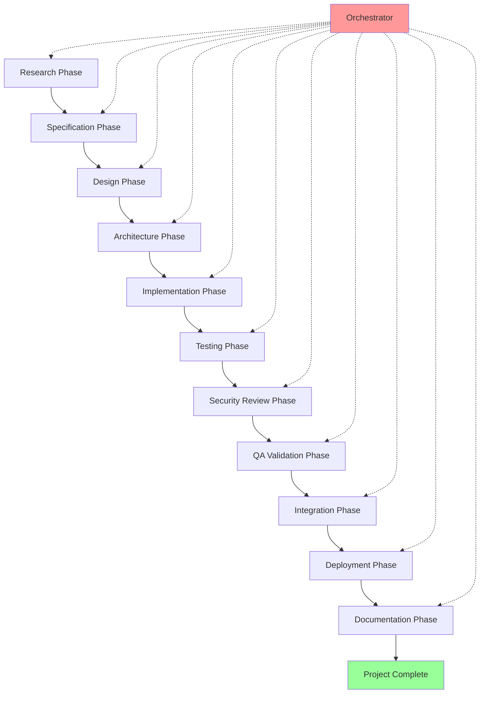
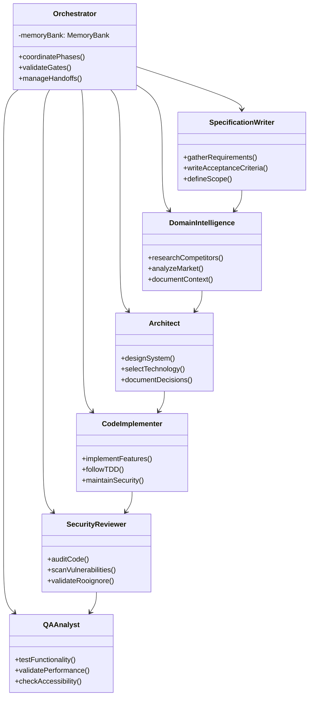
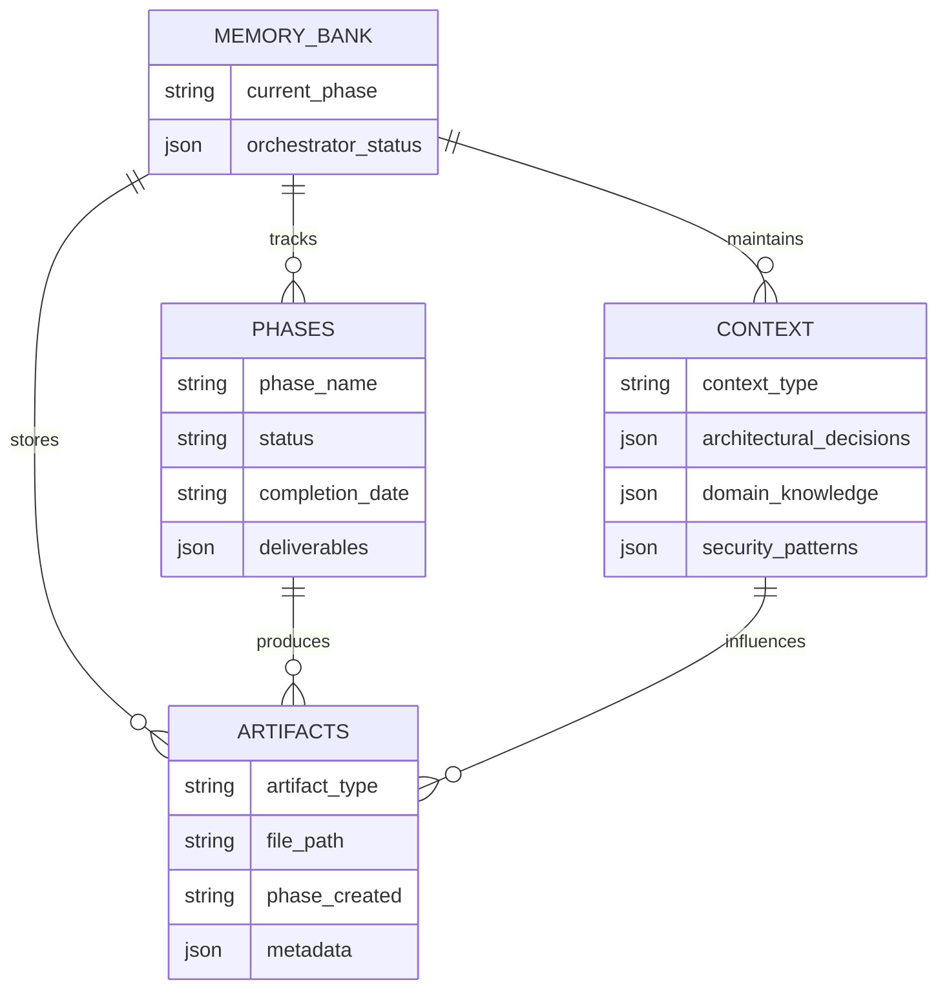
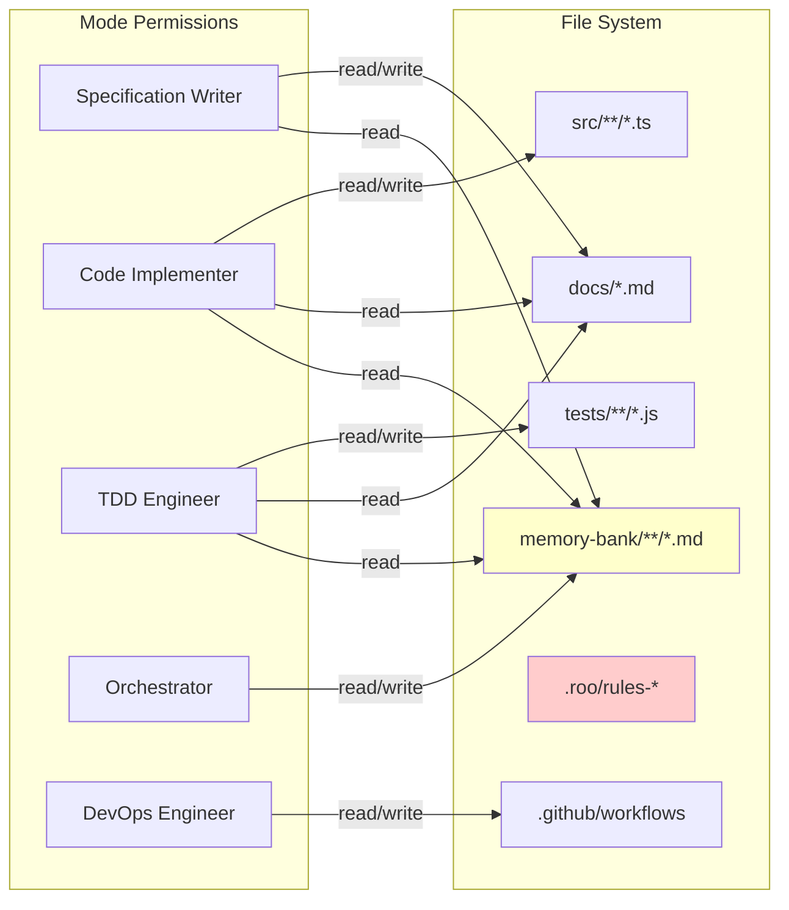

# SPARC12

AI-Assisted Development Framework Template for Roo Code

[](https://github.com/JackSmack1971/SPARC12/actions)
[](LICENSE)
[](docs/security/)

## Table of Contents

- [Quick Reference](#quick-reference)
- [Visual Architecture Overview](#visual-architecture-overview)
- [Installation](#installation)
- [Usage](#usage)
- [Project Structure](#project-structure)
- [Development Guide](#development-guide)
- [Additional Documentation](#additional-documentation)
- [Contributing](#contributing)
- [License](#license)

[↑ Back to top](#sparc12)

## Quick Reference

**SPARC12** is a comprehensive template for building AI-assisted software projects using the Roo Code ecosystem. It implements a structured 12-phase development methodology with specialized AI modes, persistent context management, and security-first practices.

### Key Features

- **🎯 12-Phase SPARC Methodology** - Structured development from specification to deployment
- **🤖 Custom AI Mode System** - 12 specialized modes with role-based file permissions
- **🧠 Memory Bank Architecture** - Persistent project context and decision tracking
- **🔒 Security-First Design** - Comprehensive `.rooignore` and automated security scanning
- **⚡ Quality Gates** - Automated validation at each development phase
- **📚 Template-Based Initialization** - Ready-to-use project structure and workflows

### Technology Stack

| Component | Technology |
|-----------|------------|
| **Framework** | Roo Code Custom Modes |
| **Scripting** | Bash/Shell |
| **CI/CD** | GitHub Actions |
| **Documentation** | Markdown |
| **Configuration** | JSON |
| **Quality Tools** | bandit, markdownlint-cli |

[↑ Back to top](#sparc12)

## Visual Architecture Overview

### SPARC Development Workflow

The SPARC methodology breaks development into 12 structured phases with clear handoffs and quality gates.



### Custom Mode Architecture

Each development phase is handled by a specialized AI mode with specific permissions and responsibilities.



### Memory Bank Structure

The memory bank provides persistent context and decision tracking across all phases.



### File Access Patterns

Security model showing how different modes access project files based on their responsibilities.



[↑ Back to top](#sparc12)

## Installation

### Prerequisites

- **Roo Code CLI** - Install from [Roo Code documentation](https://docs.anthropic.com/en/docs/claude-code)
- **Git** - For repository management
- **Node.js 18+** - For markdown linting (optional)
- **Python 3.8+** - For security scanning (optional)

### Quick Start

1. **Create a new project from this template:**
   ```bash
   git clone https://github.com/JackSmack1971/SPARC12.git my-new-project
   cd my-new-project
   rm -rf .git
   git init
   ```

2. **Configure for your project:**
   ```bash
   # Update project details in projectBrief.md
   # Modify .roomodes if needed for your specific requirements
   # Update LICENSE with your information
   ```

3. **Initialize memory bank:**
   ```bash
   # The memory bank structure is already set up
   # Start by updating memory-bank/current-phase.md
   echo "research" > memory-bank/current-phase.md
   ```

4. **Verify setup:**
   ```bash
   # Run quality checks
   ./.tools/quality-check.sh
   
   # Expected output: "All quality checks passed."
   ```

### Common Troubleshooting

- **Permission denied on quality-check.sh**: Run `chmod +x .tools/quality-check.sh`
- **Roo Code not found**: Ensure Roo Code CLI is installed and in your PATH
- **GitHub Actions failing**: Check that all referenced files exist and are properly formatted
- **Memory bank errors**: Ensure all files in `memory-bank/phases/` exist and are readable
- **Mode activation issues**: Verify `.roomodes` syntax with a JSON validator

[↑ Back to top](#sparc12)

## Usage

### Basic Workflow

The SPARC12 framework guides you through a structured development process using specialized AI modes.

#### 1. Start with Research and Specification

```bash
# Activate the orchestrator to begin
roo --mode sparc-orchestrator

# Update current phase
echo "specification" > memory-bank/current-phase.md

# Switch to specification mode
roo --mode sparc-specification-writer
```

#### 2. Gather Domain Intelligence

```bash
# Research market and competitors
roo --mode sparc-domain-intelligence

# Document findings in memory-bank/context/domain-knowledge.md
```

#### 3. Design and Architecture

```bash
# Create pseudocode blueprints
roo --mode sparc-pseudocode-designer

# Design system architecture
roo --mode sparc-architect
```

#### 4. Implementation with Quality Gates

```bash
# Implement features with TDD
roo --mode sparc-tdd-engineer
roo --mode sparc-code-implementer

# Security review
roo --mode sparc-security-reviewer

# Quality assurance
roo --mode sparc-qa-analyst
```

### Configuration Options

#### Memory Bank Configuration

The memory bank tracks project state and context:

- **`memory-bank/current-phase.md`** - Active development phase
- **`memory-bank/phases/*.md`** - Phase completion status
- **`memory-bank/context/*.md`** - Architectural decisions and patterns

#### Mode Permissions

Each mode has specific file access patterns defined in `.roomodes`:

```json
{
  "groups": [
    "read",
    ["edit", {
      "fileRegex": "^src/.*\\.(ts|tsx|js|jsx)$",
      "description": "Source code files"
    }]
  ]
}
```

#### Quality Gates

Quality validation is enforced through:

- **Automated tests** - Must pass before phase transitions
- **Security scanning** - No critical vulnerabilities allowed
- **Documentation** - All phases must update relevant docs
- **Coverage requirements** - Minimum 80% test coverage

### API Reference

**[Inference]** SPARC12 is a development framework template, not a runtime API. The "API" consists of:

- **Custom Modes** - Defined in `.roomodes` with specific instructions
- **Memory Bank** - File-based persistence layer for project context
- **Quality Scripts** - Shell-based validation in `.tools/`
- **GitHub Actions** - Automated CI/CD workflows

[↑ Back to top](#sparc12)

## Project Structure

```
SPARC12/
├── .github/workflows/          # CI/CD automation
│   └── sparc-quality.yml       # Quality checks workflow
├── .roo/                       # Roo Code configuration
│   ├── rules-sparc-*/          # Mode-specific instructions
│   └── roomodes               # Custom mode definitions
├── .tools/                     # Development utilities
│   └── quality-check.sh        # Quality validation script
├── memory-bank/                # Persistent project context
│   ├── phases/                 # Phase completion tracking
│   ├── context/                # Architectural decisions
│   ├── current-phase.md        # Active phase indicator
│   ├── architecture.md         # System architecture docs
│   └── pseudocode.md          # Algorithm blueprints
├── docs/                       # Project documentation
├── .rooignore                  # Security-focused ignore patterns
├── LICENSE                     # MIT license
├── projectBrief.md            # High-level project overview
└── README.md                  # This file
```

### Key Components

- **`.roomodes`** - Defines 12 custom AI modes with specific roles and file permissions
- **`memory-bank/`** - Central repository for project context, decisions, and phase tracking
- **`.rooignore`** - Comprehensive security configuration preventing exposure of sensitive files
- **`.roo/rules-*`** - Detailed instructions for each specialized development mode
- **Quality Pipeline** - Automated validation for task markers, secrets, and large files

### Design Principles

- **Security First** - Extensive `.rooignore` patterns protect sensitive information
- **Phase Isolation** - Each development phase has dedicated modes and deliverables
- **Context Preservation** - Memory bank maintains project knowledge across phases
- **Quality Gates** - Automated validation prevents progression with issues
- **Template Flexibility** - Easy customization for different project types

[↑ Back to top](#sparc12)

## Development Guide

### Setting Up Development Environment

1. **Install development dependencies:**
   ```bash
   # For quality checks
   pip install bandit
   npm install -g markdownlint-cli
   ```

2. **Configure your IDE:**
   ```bash
   # VS Code extensions (optional)
   code --install-extension ms-vscode.vscode-json
   code --install-extension DavidAnson.vscode-markdownlint
   ```

3. **Customize for your project:**
   ```bash
   # Update mode configurations in .roo/rules-*/
   # Modify memory bank structure if needed
   # Customize quality checks in .tools/quality-check.sh
   ```

### Build and Test Commands

| Command | Purpose |
|---------|---------|
| `./.tools/quality-check.sh` | Run all quality validations |
| `markdownlint '**/*.md'` | Lint markdown files |
| `bandit -r .` | Security vulnerability scan |
| `find . -name "*.md" -exec wc -l {} +` | Count documentation lines |

### Code Style and Conventions

**[Inference]** Based on the framework structure:

- **Markdown** - Follow standard markdown conventions, use relative links
- **JSON** - 2-space indentation for configuration files
- **Shell Scripts** - Use `set -euo pipefail` for safety
- **Documentation** - Keep memory bank files concise and actionable
- **Security** - Never commit secrets; use `.rooignore` patterns

### Quality Standards

- **No unfinished task markers** in main branch (tracked by quality checks)
- **No secrets** or credentials in repository
- **Files under 1MB** size limit
- **Comprehensive documentation** for all phases
- **Security patterns** documented in memory bank

### Contribution Guidelines

1. **Fork and create feature branch:**
   ```bash
   git checkout -b feature/your-improvement
   ```

2. **Follow SPARC methodology:**
   - Start with specification phase
   - Document decisions in memory bank
   - Follow security-first practices

3. **Validate changes:**
   ```bash
   ./.tools/quality-check.sh
   ```

4. **Submit pull request:**
   - Include clear description
   - Reference relevant memory bank updates
   - Ensure all quality checks pass

[↑ Back to top](#sparc12)

## Additional Documentation

### Framework Documentation

- **[Project Brief](projectBrief.md)** - High-level framework overview
- **[Memory Bank Guide](memory-bank/)** - Context management documentation
- **[Mode Instructions](.roo/rules-sparc-orchestrator/)** - Detailed mode behaviors

### Quality and Security

- **[Security Patterns](memory-bank/context/security-patterns.md)** - Security best practices
- **[Quality Validation](.tools/quality-check.sh)** - Automated quality checks
- **[GitHub Actions](.github/workflows/)** - CI/CD configuration

### Development Phases

- **[Architecture Status](memory-bank/phases/architecture-status.md)** - Architecture phase tracking
- **[Implementation Status](memory-bank/phases/implementation-status.md)** - Implementation progress
- **[Security Status](memory-bank/phases/security-status.md)** - Security review outcomes

### FAQ

<details>
<summary><strong>How do I customize the SPARC phases for my project?</strong></summary>

Modify the `.roomodes` file to adjust mode permissions and instructions. Update the corresponding rule files in `.roo/rules-sparc-*/` to change mode behaviors.
</details>

<details>
<summary><strong>Can I skip certain SPARC phases?</strong></summary>

While the framework is designed for comprehensive coverage, you can modify the orchestrator logic to skip phases. However, this may compromise the quality gates and security validation.
</details>

<details>
<summary><strong>How do I handle sensitive configuration?</strong></summary>

Use environment variables and ensure your `.rooignore` covers all sensitive patterns. The template includes comprehensive ignore patterns for common sensitive files.
</details>

<details>
<summary><strong>What if my project doesn't fit the standard structure?</strong></summary>

The memory bank and mode system are flexible. Update the file regex patterns in `.roomodes` and customize the memory bank structure in `memory-bank/` to match your project's needs.
</details>

[↑ Back to top](#sparc12)

## Contributing

We welcome contributions to improve the SPARC12 framework! Please read our contribution guidelines:

### Getting Started

1. **Fork the repository** and create a feature branch
2. **Follow the SPARC methodology** for your changes
3. **Update documentation** in the memory bank as you work
4. **Ensure security compliance** - no secrets or sensitive data

### Pull Request Process

1. **Validate your changes:**
   ```bash
   ./.tools/quality-check.sh
   ```

2. **Update relevant documentation:**
   - Memory bank context files
   - README.md if framework changes
   - Mode instructions if behavior changes

3. **Security checklist:**
   - [ ] No hardcoded secrets or credentials
   - [ ] `.rooignore` patterns updated if needed
   - [ ] Security patterns documented
   - [ ] Quality gates pass

4. **Submit with clear description:**
   - Explain the improvement or fix
   - Reference any related issues
   - Include testing steps

### Code of Conduct

- **Security first** - Protect sensitive information
- **Quality focused** - Maintain high standards
- **Documentation driven** - Keep context current
- **Collaborative** - Support the community

[↑ Back to top](#sparc12)

## License

This project is licensed under the **MIT License** - see the [LICENSE](LICENSE) file for details.

```
Copyright (c) 2025 JackSmack1971

Permission is hereby granted, free of charge, to any person obtaining a copy
of this software and associated documentation files (the "Software"), to deal
in the Software without restriction, including without limitation the rights
to use, copy, modify, merge, publish, distribute, sublicense, and/or sell
copies of the Software, and to permit persons to whom the Software is
furnished to do so, subject to the following conditions:

The above copyright notice and this permission notice shall be included in all
copies or substantial portions of the Software.
```

### Acknowledgments

- **Roo Code Team** - For the innovative AI-assisted development platform
- **SPARC Methodology** - Structured approach to AI-human collaboration
- **Open Source Community** - For tools and inspiration

---

<details>
<summary><strong>Analysis Notes</strong></summary>

**Generated Analysis:**
- **Repository Type:** Development Framework Template
- **Primary Technology:** Roo Code Custom Modes with Shell/Markdown
- **Architecture Pattern:** Phase-based development with AI mode specialization
- **Security Model:** Comprehensive `.rooignore` with automated validation
- **Quality Pipeline:** GitHub Actions + Shell-based quality checks

**Detected Scripts:**

- `.tools/quality-check.sh` - Quality validation (task markers, secrets, file size)
- `.github/workflows/sparc-quality.yml` - CI/CD automation

**Environment Variables:** None detected (template-based configuration)

**[Inference] Notes:**

- Live demo links omitted (framework template, not deployed application)
- Version badge omitted (no package.json or version file detected)
- API documentation minimal
  (framework provides development methodology, not runtime API)

</details>

**Generated on 2025-01-27 23:17:43 UTC**

[↑ Back to top](#sparc12)
